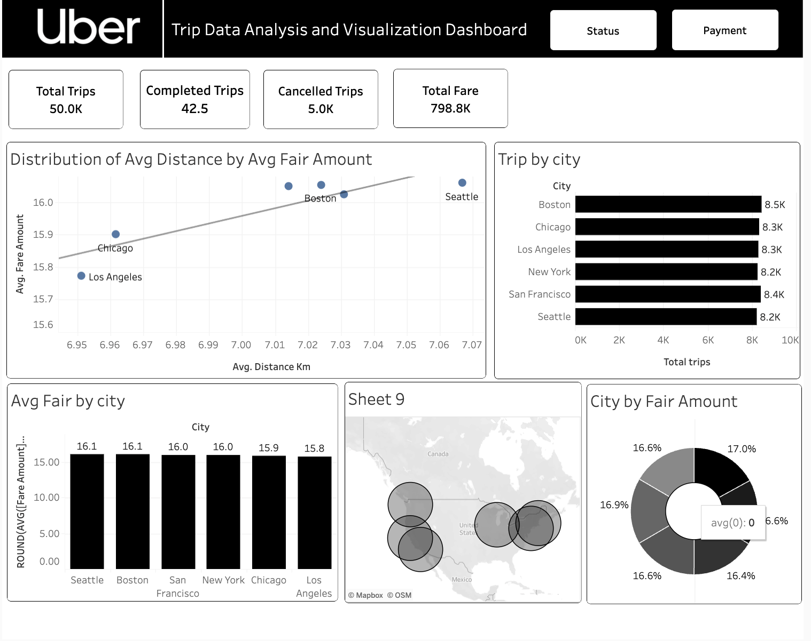
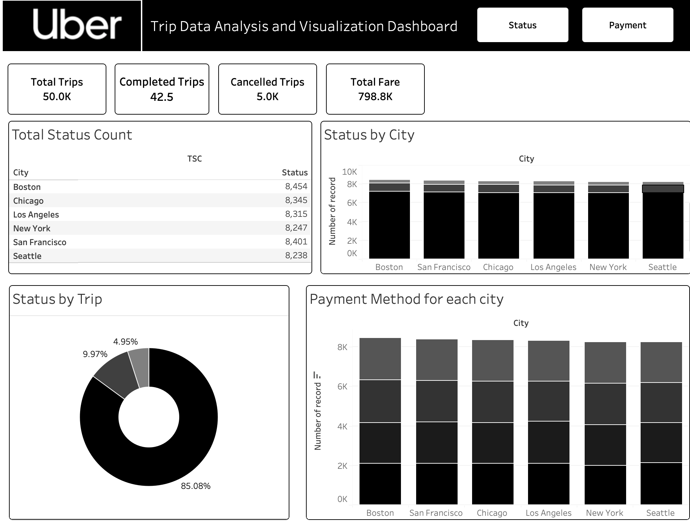
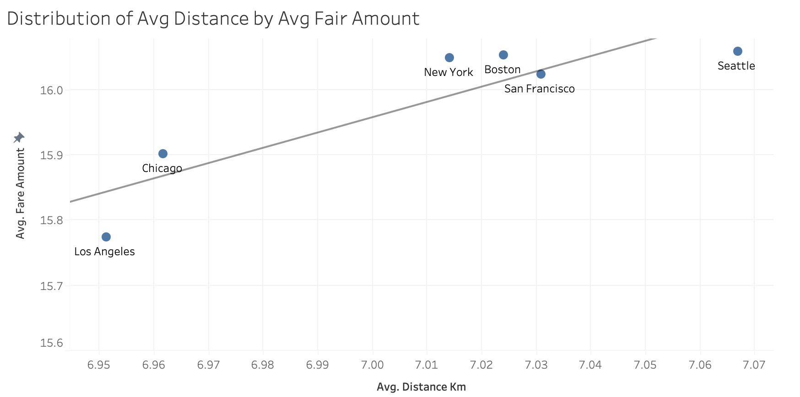
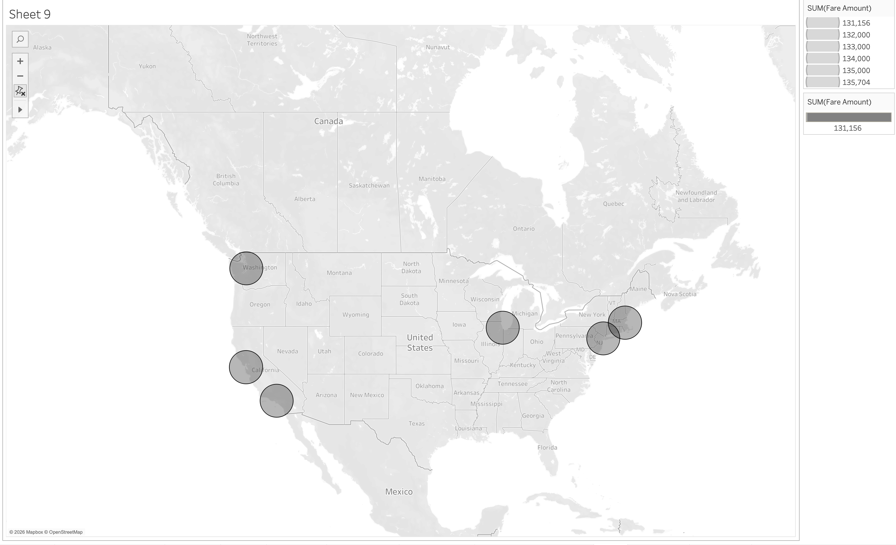

# Uber Trip Analytics Dashboard (Tableau)

  
  
  

A data-driven dashboard exploration of Uber trip patterns designed to uncover **prime driving hours, preferred service categories, and high-earning location clusters**.

## Tech Stack

  
  
  
  

## What's included

- **Interactive Tableau dashboard** for exploring revenue trends, demand patterns, category breakdowns, and route performance
- **Static chart exports** (PNG) enabling repository review without Tableau access
- **Key metrics summary** with actionable insights for strategic decision-making

## Quick overview

## Data highlights

From the `REAL ROUTES` sheet in `UBER_RAW.xlsx` (721 analyzed trips after data cleaning):

- **Total revenue**: `R$11,535.34`
- **Average fare / trip**: `R$16.00`
- **Average distance**: `5.14 km`
- **Average duration**: `12.53 min`

## Core findings

- **Peak demand windows** occur during daytime and early evening, showing sustained high trip volumes.
- **`Comfort` category dominates** in both trip frequency and revenue contribution.
- **Revenue concentrates on repeat routes**, indicating strong neighborhood demand patterns.
- **Fast review**: chart exports enable complete repository assessment in under 2 minutes.

## Visual analytics

### 1) Hourly revenue vs. trip volume

### 2) Revenue by ride category

### 3) Top routes by revenue

## Strategic questions addressed

- **Optimal timing**: which hours deliver the best revenue-to-trip ratio?
- **Service preferences**: which ride categories drive the highest earnings?
- **High-value routes**: which pickup → dropoff pairs generate maximum returns?
- **Pattern stability**: how consistent are trends across seasons and areas?
- **Operational efficiency**: where can time and distance be optimized while maintaining revenue?

## Approach

- **Currency normalization** from formatted strings (e.g., `R$47.81`)
- **Time and distance conversion** to numeric formats for aggregation
- **Location label standardization** for reliable route grouping
- **Data filtering** to remove duplicates and incomplete entries before analysis

## Technology stack

- **Tableau**: dashboard creation + interactive analysis (`Uber.twbx`)
- **CSV**: dataset containing trip data (`uber_trips_dataset_50k.csv`)
- **Python**: automated chart generation for static exports in `charts/`

## Project structure

- `README.md`: project documentation
- `Uber.twbx`: Tableau workbook with interactive dashboard
- `uber_trips_dataset_50k.csv`: dataset containing raw trip data
- `charts/`: dashboard screenshots and static chart exports

## Review guide

1. **Start here**: browse the dashboard preview and 3 key charts.
2. **Interactive exploration**: open `Uber.twbx` to use filters and drill-down features.
3. **Data validation**: examine `uber_trips_dataset_50k.csv` for data quality.

